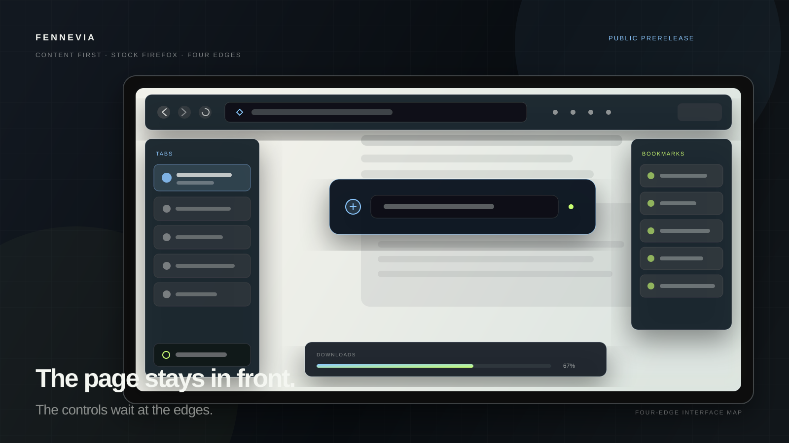

# Fennevia

[English](README.md)



_這是介面配置的風格化示意圖，不是 Firefox 相容性或驗證結果的實機截圖。_

Fennevia 是一個為**原版 Firefox**製作、實驗性且以網頁內容為中心的瀏覽器介面。它讓網頁保持在畫面主體，並把瀏覽器控制項放到四個平時隱藏、需要時才浮現的邊緣面板。

> [!WARNING]
> Fennevia 是公開的**預發行版本**，不是穩定的日常使用產品。它會執行高權限程式碼，並依賴 Firefox 不保證穩定的內部介面。目前只在 Firefox **153** 與 **154** 上測試過。較新的 Firefox 可能會讓介面故障。若你在較新版本上確認安裝，**不保證**所有功能都能正常運作。請使用專用 Firefox 設定檔，並保留下載的發行壓縮檔，以便之後停用或移除。

## Fennevia 會改變甚麼

在靜止狀態下，Firefox 主要只顯示目前網頁。把滑鼠移到視窗邊緣，或使用鍵盤，即可顯示：

- **上方：**不可停用的基底橫列。明確的新版預設依序放置上一頁、下一頁、重新載入／停止、首頁、Trust、可延伸的網址啟動器、Firefox 功能、Fennevia 自訂及專案自有的視窗控制項。
- **左方（預設）：**基底直欄放置新增分頁及可延伸的分頁區；固定且有高度上限的釘選分頁區位於可獨立捲動的一般分頁上方。此面板可獨立停用。
- **右方（預設）：**基底直欄放置可延伸、帶 Firefox 快取網站圖示的書籤。此面板可獨立停用。
- **下方：**基底橫列預設把匿名下載進度及狀態置中；下載狀態可移到其他面板，下方面板也可獨立停用。
- **中央：**從網址啟動器或按 <kbd>Ctrl</kbd>+<kbd>L</kbd> 開啟的網址／搜尋彈出面板。無障礙結果清單直接使用 Firefox 已啟用的 Urlbar 供應器與搜尋建議；Fennevia 不會另建搜尋引擎或建議服務。

四個面板本身都有不可移除的基底排列：上、下為橫列，左、右為直欄。元件庫中的橫列／直欄可建立巢狀群組，Center、Expanded 與 Padding 可包住一個子元件；一般子元件維持自然尺寸及起始順序，只有 Expanded 或彈性空間會取得剩餘空間。新版預設不再複製目前 Firefox 工具列裡因設定檔而異的擴充套件、空白與彈性空間；這些項目仍可從元件庫加入。有效的既有自訂版面不會被自動覆寫，「重設版面」才會套用新版預設。

書籤列中鍵會在新分頁開啟網站。分頁拖曳時，實際分頁列會在原本的 tab bar 內跟著游標移動，相鄰分頁則讓出預計落點；清單頂端、底端與「新增分頁」區域提供較大的落點。進入另一個相同視窗類型的 Fennevia 視窗時，目標分頁列會立即顯示並保持開啟；可插入指定位置，放到該 Firefox 視窗的瀏覽內容區則附加到列尾，放到 Firefox 以外則交由 Firefox 分離成視窗。目標列會用實際版面預留新分頁位置，少量分頁時不會因拖曳位移誤顯捲軸；拖曳沿用 Firefox 的一般游標。拖曳資料不含文字或網址格式，視窗事件與來源分頁狀態同步會在所有結束路徑釋放分頁面板的顯示 hold。

上、下方細燈條可各自選擇顯示網頁載入、整體下載進度或關閉；預設仍為上方載入、下方下載。Firefox 原生角落狀態文字的內容與生命週期維持不變，但在 Fennevia 啟用時會顯示成較精簡、跟隨主題的膠囊。

安全提示、權限、憑證、擴充套件安裝、下載安全、DevTools、完整原生網址列，以及自訂視窗按鈕背後的視窗指令仍由 Firefox 負責。原生標題列按鈕節點會保留，以便失敗時立刻復原。遇到不支援的功能或需要復原時，Fennevia 可以重新顯示完整的 Firefox 原生介面。

## 目前版本

目前公開預發行版本是 [`v0.15.0-beta.1`](https://github.com/yutinglia/fennevia/releases/tag/v0.15.0-beta.1)，接續 [`v0.14.0-beta.1`](https://github.com/yutinglia/fennevia/releases/tag/v0.14.0-beta.1)。測試範圍刻意限制得很窄：

| 要求             | 已測試值                                               |
| ---------------- | ------------------------------------------------------ |
| 作業系統         | Windows x64                                            |
| Firefox          | 原版 Firefox 153.0.4 與 154.0，Release channel         |
| Firefox Build ID | `20260810162159`（153.0.4）、`20260812182057`（154.0） |
| 套件             | `fennevia-0.15.0-beta.1-windows.zip`                   |

Firefox 153 以前的版本會被拒絕安裝、更新、修復及重新啟用。153、154 以及更新的主版本可在安裝程式警告後安裝：目前只測試過 153 與 154，較新版本可能故障，確認安裝並不保證一切都能運作。Firefox 更新後仍可使用停用及移除功能進行復原。此版本不支援 Linux、macOS、Firefox ESR、Beta 及 Nightly。

安裝預先建置的發行版**不需要** Node.js、npm，也不需要自行編譯 Firefox。

## 目前進度

Fennevia 已經超越首個四邊介面 MVP。目前預發行版亦包括 Fennevia 自有的 widget 編輯器，可把 widget 即時拖放到四個邊緣；分頁式自訂抽屜與可選精簡視窗；Firefox 原生多選分頁、固定的釘選分頁區，以及中鍵／快速鍵開新分頁插在目前分頁之後；書籤快取圖示與中鍵開新分頁；具可見跨視窗落點預覽、跨視窗轉移及 Firefox 原生分離視窗路徑的空間式分頁拖曳；有限度的外觀、面板角色、燈條來源與邊緣互動設定；預設跟隨 Firefox 設計 token；英文與繁體中文介面；啟動首幀隱藏原生工具列；以及 Windows 的 `FenneviaSetup.exe` 安裝精靈。

目前預發行版亦會把 Firefox 自己每個視窗的 Urlbar provider manager 所產生、經限制的結果投影到中央 combobox。搜尋引擎、供應器選擇、排序、搜尋建議／私密視窗政策及結果執行仍由 Firefox 負責。一般結果會交回 Firefox 的 `pickResult`；豐富或未知結果則開啟完整原生網址列。這項工作已有針對性測試，以及 Firefox 154 的供應器合約、正式面板、故障注入與發行候選探針；具代表性的供應器矩陣仍未完成。

最近一次記錄的 Firefox 154 自動化生命週期、回復、效能對照、可重現封裝及解壓包安裝生命週期，仍是 `0.12.0-beta.1` 候選版；此 `0.15.0-beta.1` 套件沒有重跑該矩陣。完整的 Firefox 實機視覺、輔助科技、帳號／裝置、原生彈出面板定位、自訂模式、啟動首幀、GUI 安裝流程及具代表性的 Urlbar 供應器測試矩陣仍未完成。因此目前主要欠缺的是相容性與發行驗證，而不是核心瀏覽器介面功能。詳情請參閱[目前專案狀態（英文）](docs/current-status.md)，當中整理了已完成能力、證據邊界、已知風險及建議優先次序。

## 安裝

### 1. 準備 Firefox

1. 在 Firefox 開啟 `about:profiles`。
2. 為 Fennevia 建立或選擇一個**專用設定檔**。
3. 記下該設定檔的 **Root Directory（根目錄）**。設定檔必須已向 Firefox 註冊；透過 `about:profiles` 建立的設定檔符合此要求。
4. 找出準備使用的 `firefox.exe`。常見位置是 `C:\Program Files\Mozilla Firefox\firefox.exe`。
5. 關閉所有正在使用該程式或設定檔的 Firefox 視窗、Browser Console 及 Browser Toolbox。

若 Firefox 安裝在受系統保護的位置，寫入 AutoConfig 可能需要系統管理員權限。Fennevia Setup 只有在你選擇「以系統管理員繼續」後才會顯示 Windows 權限提示，不會在開啟精靈時自動提權。

### 2. 下載並驗證發行檔

從同一個 GitHub Release 下載：

- `fennevia-0.15.0-beta.1-windows.zip`
- `fennevia-0.15.0-beta.1-windows.zip.sha256`

解壓縮前，在下載目錄開啟 PowerShell 並執行：

```powershell
$expected = (Get-Content -Raw .\fennevia-0.15.0-beta.1-windows.zip.sha256).Split()[0]
$actual = (Get-FileHash -Algorithm SHA256 .\fennevia-0.15.0-beta.1-windows.zip).Hash.ToLowerInvariant()
if ($actual -cne $expected) { throw "Fennevia release checksum mismatch." }
```

若 SHA-256 校驗值不相符，請不要繼續。

### 3. 預覽安裝變更

解壓縮 ZIP，在解壓後的 Fennevia 目錄雙擊 `FenneviaSetup.exe`。請自行選擇 `firefox.exe` 與一個已註冊的設定檔**名稱**。Fennevia 不會預先選取 Firefox 預設設定檔。請先閱讀僅測試 153／154 的警告，再檢查遮罩後的變更計劃並確認套用。在較新 Firefox 上確認安裝，並不保證介面能繼續正常運作。若所選 Firefox 程式資料夾無法寫入，請選擇「以系統管理員繼續」並同意 Windows 提示。

請保留此解壓資料夾。進階使用者仍可使用 PowerShell 主控台：

```powershell
pwsh -NoProfile -File .\scripts\fennevia.ps1
```

不要把真實設定檔路徑貼到 issue 或公開紀錄。對應的指令列寫法是：

```powershell
$firefox = '<FIREFOX_PROGRAM>\firefox.exe'
$profile = '<FIREFOX_PROFILE>'

pwsh -NoProfile -File .\scripts\fennevia-package.ps1 Install `
  -FirefoxPath $firefox -ProfilePath $profile `
  -ProfileMode Registered -WhatIf
```

README 的指令使用 PowerShell 7（`pwsh`）。套件亦已使用 Windows PowerShell 5.1 驗證；發行檔內的 `INSTALL.md` 包含完整的更新、復原及移除說明。

### 4. 正式安裝

在 Fennevia Setup 檢查預覽後，確認畫面上的變更計劃。對應的指令列寫法是再執行一次不含 `-WhatIf` 的命令：

```powershell
pwsh -NoProfile -File .\scripts\fennevia-package.ps1 Install `
  -FirefoxPath $firefox -ProfilePath $profile `
  -ProfileMode Registered
```

使用所選設定檔啟動 Firefox。請保留完整的解壓目錄或原始 ZIP；更新、修復、重新啟用及部分復原操作會驗證原始套件內容。

更新、停用、修復、重新啟用及移除指令請參閱：

- [發行版安裝與復原指南（英文）](release/INSTALL.md)
- [完整套件生命週期參考（英文）](docs/installation.md)

## 日常操作與復原

把滑鼠移到對應的視窗邊緣即可顯示面板。當介面健康運作時，<kbd>Ctrl</kbd>+<kbd>L</kbd> 會開啟 Fennevia 的中央網址／搜尋彈出面板。需要完整 Firefox 網址列、豐富／不支援的供應器結果、搜尋 one-off、擴充套件操作或原生面板時，請選擇 **Open Firefox address bar**。

若 Firefox 仍在執行，但自訂介面無法正常使用，請按 <kbd>Ctrl</kbd>+<kbd>Alt</kbd>+<kbd>Shift</kbd>+<kbd>F12</kbd>，啟用內建的 Firefox 原生介面復原功能。若快捷鍵也失效，請關閉 Firefox，並使用同一個發行套件執行 `Disable`。不要手動刪除 Firefox 程式或設定檔內不確定用途的檔案。

## 介面語言

Fennevia 跟隨 Firefox 自己選單與訊息使用的語言，而不是網站的 `Accept-Language`。目前介面只提供英文與繁體中文。Fennevia 不會另外提供語言選擇器。

- Firefox 介面為任何中文（`zh`、`zh-Hant`、`zh-Hans`、`zh-TW`、`zh-CN` 及其他 `zh-*`）時，**目前一律使用繁體中文**，因為尚未提供簡體中文文案。
- 其他 Firefox 介面語言則使用英文。

Firefox 原生選單、通知與工具列 widget 名稱仍跟隨 Firefox 本身。

## 重要限制

- Fennevia 使用 Mozilla 不保證穩定的 Firefox 內部介面。
- Firefox 正常更新後，可能進入尚未測試的版本。較新版本可能讓介面故障。你可以在安裝程式警告後繼續使用，或保持停用／移除。確認安裝並不是支援承諾。
- 目前沒有自動更新、程式碼簽署或可驗證建置／發行證明（attestation），亦未完成獨立安全審計。
- 目前發行版只支援 Windows，並不代表穩定或長期支援承諾。
- 書籤編輯、完整下載管理、進階原生網址列功能及擴充套件整合仍可透過 Firefox 完整原生介面使用。

## 保留主觀結構，提供有限度自訂

Fennevia 仍按照作者的「以內容為中心」產品方向設計。四個固定邊緣主體、平時隱藏的行為、共用顯示控制、原生功能擁有權邊界及整體互動層級，都是刻意的產品決定；面板內的元件與有限度巢狀幾何則可重新組合。

Fennevia 自訂模式可以把支援的專案功能與 Firefox 工具列元件放到任何邊緣，以有限深度的橫列／直欄與包裝元件組合、切換主功能方向、獨立啟用左／右／下方面板，並選擇允許相容控制項出現在多個位置。它亦可調整有限度、儲存在設定檔內的面板／視窗背景、文字、邊框、飽和度、陰影、動效、移入網頁與離開瀏覽器視窗時各自的隱藏時間、暫時顯示時間、可設為零以隱藏的快速鍵提示時間，以及邊緣觸發區厚度。它刻意不是通用 CSS 編輯器、任意指令載入器、擴充平台或無限制的介面產生器。

## 文件

根目錄 README 刻意只保留公開、面向一般使用者的資訊。更深入的內容按讀者類型整理：

- [文件導覽（英文）](docs/README.md)
- [目前專案狀態（英文）](docs/current-status.md)
- [技術概覽及目前工程進度（英文）](docs/technical-overview.md)
- [架構（英文）](docs/architecture.md)
- [測試與復原（英文）](docs/testing-and-recovery.md)
- [Firefox 更新流程（英文）](docs/firefox-update-workflow.md)
- [安全與私隱（英文）](docs/security-and-privacy.md)
- [參與開發（英文）](CONTRIBUTING.md)

歷史相容性研究及驗證紀錄放在 [`docs/research/`](docs/research/)。這些文件描述當時實際測試的里程碑，不會被改寫成好像較後期功能當時已經存在。

## 授權

Fennevia 的原創源碼、文件及專案產生的輸出採用 [MPL-2.0](LICENSE)。

第三方內容仍受各自授權條款約束，詳情請參閱 [THIRD_PARTY_NOTICES.md](THIRD_PARTY_NOTICES.md) 及[授權與來源政策](docs/licensing-and-provenance.md)。
