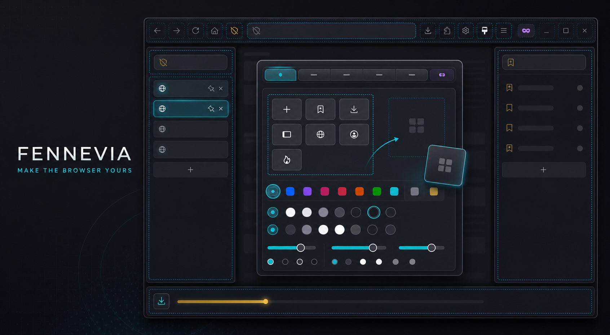
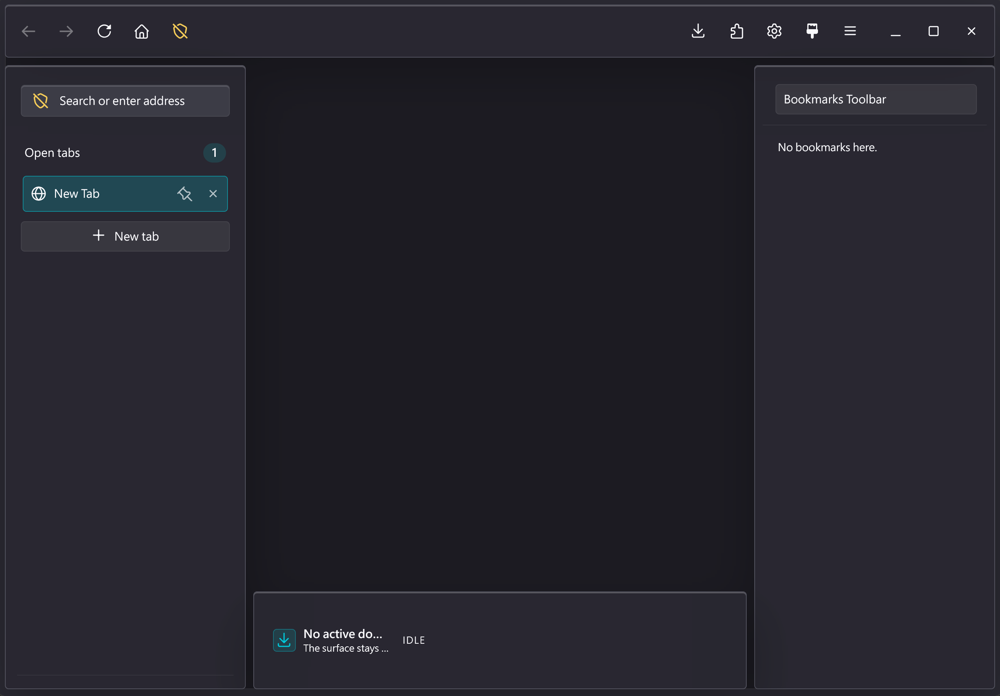
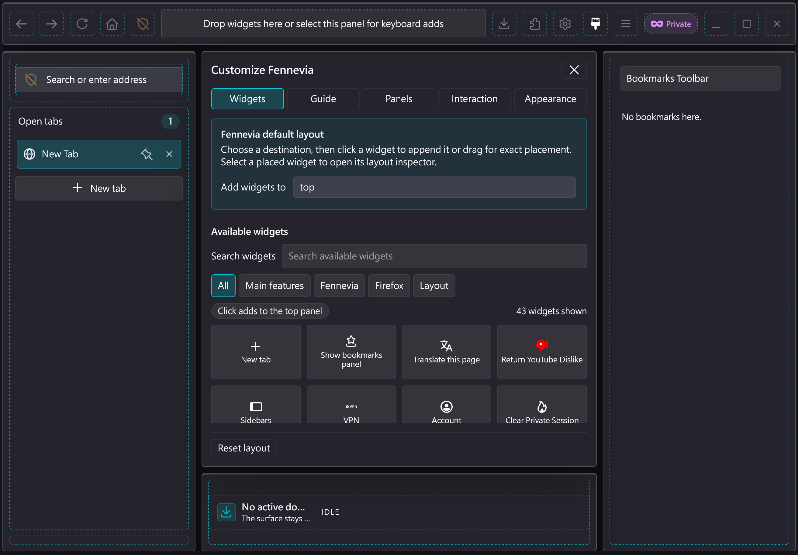
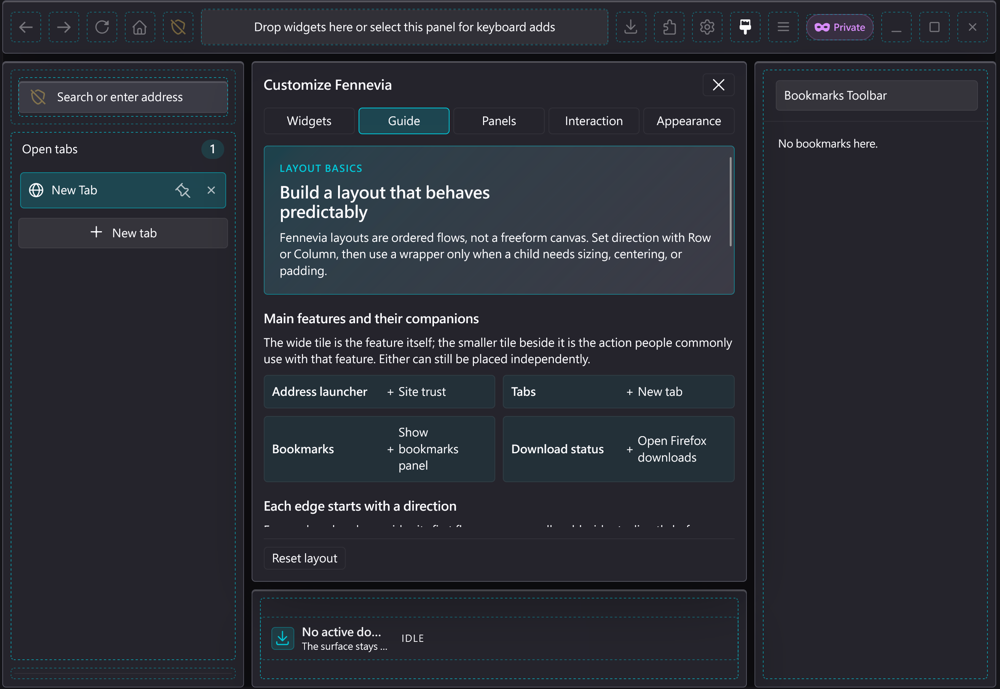
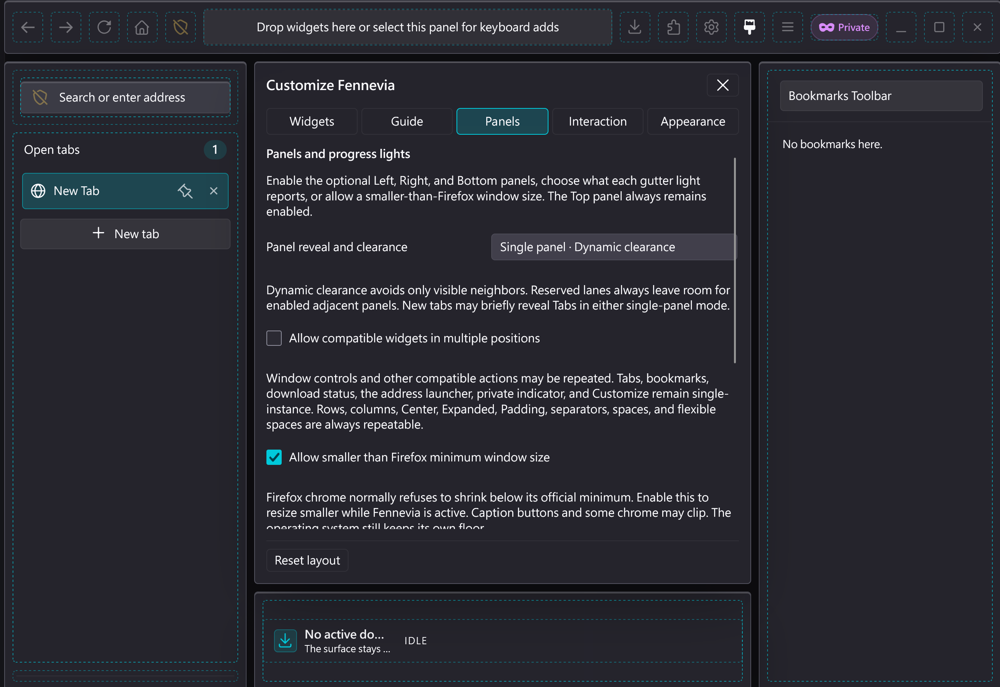
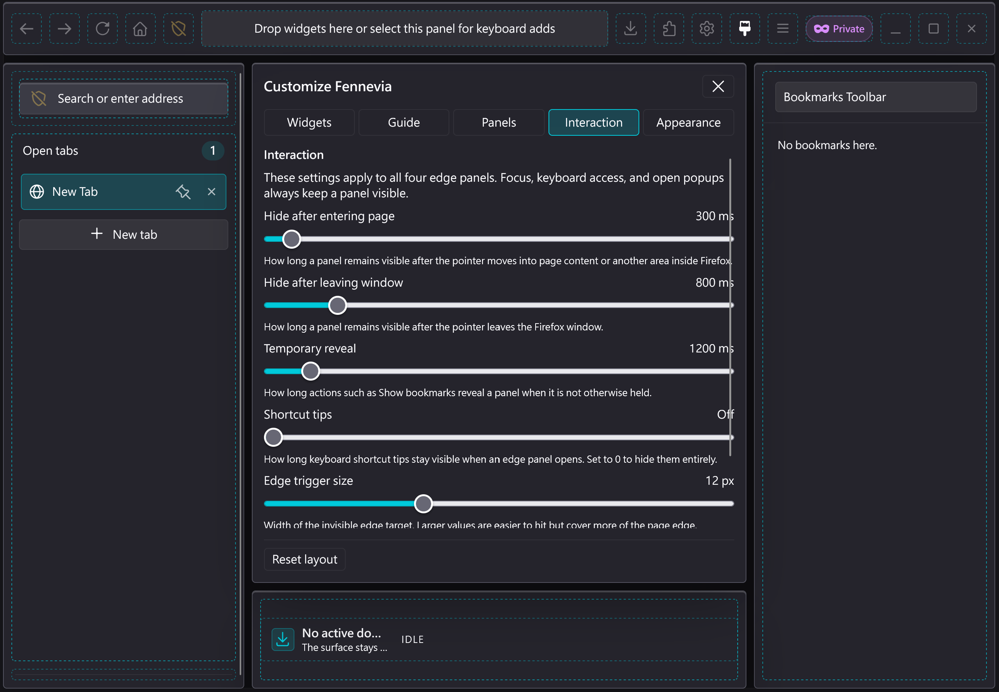
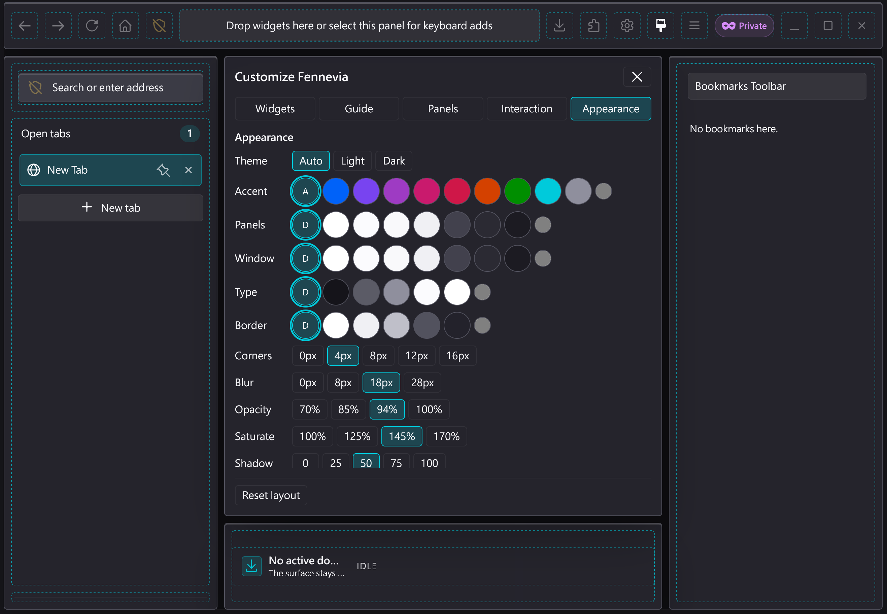

# Fennevia

[English](README.md)



_這是專案風格化主視覺；下方另有目前版本的實機擷取畫面。_

Fennevia 是一個為**原版 Firefox**製作、實驗性且以網頁內容為中心的瀏覽器介面。它讓網頁保持在畫面主體，並把瀏覽器控制項放到四個平時隱藏、需要時才浮現的邊緣面板。

> [!WARNING]
> Fennevia 是公開的**預發行版本**，不是穩定的日常使用產品。它會執行高權限程式碼，並依賴 Firefox 不保證穩定的內部介面。目前只在 Firefox **153** 與 **154** 上測試過。較新的 Firefox 可能會讓介面故障。若你在較新版本上確認安裝，**不保證**所有功能都能正常運作。請使用專用 Firefox 設定檔，並保留下載的發行壓縮檔，以便之後停用或移除。
> Fennevia 跟隨目前最新的原版 Firefox **Release** channel；不打算長期維護所有歷史 Firefox 版本，也不以 ESR、Beta 或 Nightly 為目標。

## Fennevia 會改變甚麼

在靜止狀態下，Firefox 主要只顯示目前網頁。把滑鼠移到視窗邊緣，或使用鍵盤，即可顯示：

- **上方：**不可停用的基底橫列。明確的新版預設依序放置上一頁、下一頁、重新載入／停止、首頁、Trust、空白的可延展區、Firefox 功能、Fennevia 自訂及專案自有的視窗控制項。
- **左方（預設）：**基底直欄放置有標準內距的網址／狀態橫列、整合新增分頁的可延伸分頁區及分隔線；固定且有高度上限的釘選分頁區位於可獨立捲動的一般分頁上方。此面板可獨立停用。
- **右方（預設）：**基底直欄放置可延伸、帶 Firefox 快取網站圖示的書籤。此面板可獨立停用。
- **下方：**基底橫列預設把匿名下載進度及狀態置中；下載狀態可移到其他面板，下方面板也可獨立停用。
- **中央：**從網址啟動器或按 <kbd>Ctrl</kbd>+<kbd>L</kbd> 開啟的網址／搜尋彈出面板。無障礙結果清單直接使用 Firefox 已啟用的 Urlbar 供應器與搜尋建議；Fennevia 不會另建搜尋引擎或建議服務。啟動器保留 Firefox 精簡的已提交值，新開啟並取得焦點的編輯器則使用 Firefox 保留的完整值，包括原本被精簡的 `https://` 前綴。

## 打造自己的瀏覽器版面

完整自訂系統是 Fennevia 的主要產品特色之一，不只是重新排列幾個按鈕。幾乎所有看得到的部分都是 widget：導覽控制、網址啟動器、分頁、書籤、下載狀態、Firefox 工具、擴充套件按鈕、隱私瀏覽指示、視窗控制等等。你可以把它們拖到上、左、右、下四個面板，組成真正適合自己的瀏覽器。

- **組合真正的版面。** 巢狀 Row／Column 可以建立群組；Center、Padding、分隔線可調整結構；只有 Expanded 或彈性空間會取得剩餘空間，其他子項目會維持自然尺寸並由起點依序排列。選取 Row 或 Column 後亦可套用單一標準內容內距，讓小型控制項與大型 widget 的內容邊緣對齊。
- **轉換主要功能方向。** 分頁、書籤、下載及網址啟動器會適應水平或垂直位置。你可以把垂直分頁放在左側，也可以在上方或下方建立水平分頁列。
- **在合理的地方重複控制項。** 開啟多重放置後，視窗按鈕等安全控制項可以同時出現在上方與左方。Row、Column、Center、Expanded、Padding、分隔線、空白及彈性空間永遠可以重複；有狀態的主要功能則維持單一實例。
- **選擇實用樣式。** 網址啟動器可以直接包含 Trust／網站狀態按鈕；分頁列可以在最後一個分頁後直接包含「新增分頁」。
- **決定面板如何互相避讓。** 可選擇同時只顯示一個或允許多個面板，再搭配動態避讓或固定保留邊緣空間。左、右、下可分別停用；上方面板永遠保留。

例如，要讓書籤佔滿右側剩餘高度、下載狀態只佔底下一列，可以把兩者放入 Column，只用 Expanded 包住書籤，下載列就會維持自然高度。也可以讓視窗控制同時出現在上方與左方，而寬版網址列只留在上方。

自訂模式會讓空白但已啟用的面板保持為完整放置目標；拖曳時顯示精確插入預覽，並標示每個可編輯 widget。選取 widget 時只會開啟一個浮動設定面板，移動、移除、wrapper 與樣式控制不會堆滿畫面；拖曳 widget 期間，這個設定面板會淡出並讓出指標命中，不會蓋住下方落點。「清空所有面板」會先要求確認、把採用的 Firefox widget 放回原處，並在上方保留必要的自訂按鈕；「重設版面」則還原新版 Fennevia 預設。至少一個已啟用面板必須保留自訂按鈕，有效的既有版面不會被默默覆寫。

## 畫面展示

以下由專案擁有者提供的實機擷取畫面，顯示 `v0.18.0-beta.1` 的布局，以及由五個分頁組成的自訂工作區。它們只證明此處呈現的介面狀態，不能取代尚未完成的完整 Firefox 實機驗證矩陣。

### 新版四邊預設布局



### 自訂整個瀏覽器介面

| 元件與精確放置 | 版面指南 |
| :------------: | :------: |
|  |  |

| 面板行為 | 互動時間 |
| :------: | :------: |
|  |  |

**外觀**



## 受防護的 Firefox API 橋接層

Fennevia 不會讓每個 widget 直接存取 Firefox 的高權限內部物件。小型、安全導向的 Firefox API bridge 是 Svelte 介面與 Firefox 之間唯一的通道：它會確認必要能力存在、驗證跨越邊界的值，並只提供有界狀態快照與範圍明確的動作，而不是把原生 Firefox 物件交給 widget。

因此，分頁、書籤、下載、安全提示、權限、憑證、擴充套件安裝、原生選單與視窗指令的真正擁有者仍是 Firefox；Fennevia 不會取代這些安全敏感流程。啟動或必要功能失敗時，專案會移除自己建立的介面並回復保留的 Firefox 原生介面。安裝後的 runtime 不會載入遠端指令碼、分析服務或遙測。

這種設計會減少每項功能能接觸的高權限範圍，也讓失敗更容易被限制及清理；但 Fennevia 仍是使用 Firefox 不保證穩定之內部介面的實驗性程式，這不是 sandbox，也不代表已完成獨立安全稽核。

書籤列中鍵會在新分頁開啟網站。分頁拖曳時，實際分頁列會在原本的 tab bar 內跟著游標移動，相鄰分頁則讓出預計落點；清單頂端、底端與「新增分頁」區域提供較大的落點。進入另一個相同視窗類型的 Fennevia 視窗時，目標分頁列會立即顯示並保持開啟；可插入指定位置，放到該 Firefox 視窗的瀏覽內容區則附加到列尾，放到 Firefox 以外則交由 Firefox 分離成視窗。目標列會用實際版面預留新分頁位置，少量分頁時不會因拖曳位移誤顯捲軸；拖曳沿用 Firefox 的一般游標。拖曳資料不含文字或網址格式，視窗事件與來源分頁狀態同步會在所有結束路徑釋放分頁面板的顯示 hold。

上、下方細燈條可各自選擇顯示網頁載入、整體下載進度或關閉；預設仍為上方載入、下方下載。Firefox 原生角落狀態文字的內容與生命週期維持不變，但在 Fennevia 啟用時會顯示成較精簡、跟隨主題的膠囊。

安全提示、權限、憑證、擴充套件安裝、下載安全、DevTools、完整原生網址列，以及自訂視窗按鈕背後的視窗指令仍由 Firefox 負責。原生標題列按鈕節點會保留，以便失敗時立刻復原。遇到不支援的功能或需要復原時，Fennevia 可以重新顯示完整的 Firefox 原生介面。

## 目前版本

目前公開預發行版本是 [`v0.18.0-beta.1`](https://github.com/yutinglia/fennevia/releases/tag/v0.18.0-beta.1)，接續 [`v0.17.0-beta.1`](https://github.com/yutinglia/fennevia/releases/tag/v0.17.0-beta.1)。測試範圍刻意限制得很窄：

| 要求             | 已測試值                                               |
| ---------------- | ------------------------------------------------------ |
| 作業系統         | Windows x64                                            |
| Firefox          | 原版 Firefox 153.0.4、154.0 與 154.0.1，Release channel |
| Firefox Build ID | `20260810162159`、`20260812182057`、`20260824154132`   |
| 套件             | `fennevia-0.18.0-beta.1-windows.zip`                   |

Firefox 153 以前的版本會被拒絕安裝、更新、修復及重新啟用。153、154 以及更新的主版本可在安裝程式警告後安裝：目前只測試過 153 與 154，較新版本可能故障，確認安裝並不保證一切都能運作。Firefox 更新後仍可使用停用及移除功能進行復原。此版本不支援 Linux、macOS、Firefox ESR、Beta 及 Nightly。

Fennevia 會以開發當下最新的原版 Firefox stable release 為主要目標。上方的 153／154 是此套件的實際驗證證據，不代表專案承諾永遠維持每個舊版相容。未來 Firefox stable 更新可能需要新版 Fennevia；不支援的 channel 與歷史相容分支刻意不在產品範圍內。

安裝預先建置的發行版**不需要** Node.js、npm，也不需要自行編譯 Firefox。

## 目前進度

Fennevia 已經超越首個四邊介面 MVP。目前預發行版亦包括 Fennevia 自有的 widget 編輯器，可把 widget 即時拖放到四個邊緣；分頁式自訂抽屜、遮暗並阻擋網站點擊的自訂模式背景層，以及可選精簡視窗；Firefox 原生多選分頁、固定的釘選分頁區，以及中鍵／快速鍵開新分頁插在目前分頁之後；書籤快取圖示與中鍵開新分頁；具可見跨視窗落點預覽、跨視窗轉移及 Firefox 原生分離視窗路徑的空間式分頁拖曳；有限度的外觀、面板角色、燈條來源與邊緣互動設定；預設跟隨 Firefox 設計 token；英文與繁體中文介面；啟動首幀隱藏原生工具列；以及 Windows 的 `FenneviaSetup.exe` 安裝精靈。

目前預發行版亦會把 Firefox 自己每個視窗的 Urlbar provider manager 所產生、經限制的結果投影到中央 combobox。搜尋引擎、供應器選擇、排序、搜尋建議／私密視窗政策及結果執行仍由 Firefox 負責。一般結果會交回 Firefox 的 `pickResult`；豐富或未知結果則開啟完整原生網址列。這項工作已有針對性測試，以及 Firefox 154 的供應器合約、正式面板、故障注入與發行探針；具代表性的供應器矩陣仍未完成。

此版本新增以主要功能為先的元件庫與可選版面指南、較精簡的搜尋優先網址彈出面板、首次空白零前綴 Urlbar 查詢的一次性有界重試、窄視窗四面板重排，以及更安全的分頁分離意圖判斷。巢狀版面處理器不再取消子分頁的拖曳生命週期；已知 Firefox 內建 widget 亦會先使用同步 Fluent 名稱，再退回舊式查詢。

此版本會讓啟動器維持精簡，但在新開啟的編輯器取得焦點時使用 Firefox 保留的完整網址；亦保留使用 token 的垂直留白，改由有標準內距的父 Row 統一負責網址列與分頁列的水平對齊、維持固定高度 Top 的安全內距，並提供上述可選的 Row／Column 標準內容內距。新版預設已採用這個四面配置，自訂模式也會遮暗並阻擋網站指標操作。窄視窗 Top 的捲軸可以拖曳，其餘空白標題列區域仍可拖曳視窗。中央網址面板保留原有間距。這些變更已包含在 `v0.18.0-beta.1` 壓縮檔。

`0.18.0-beta.1` 發行版已在 Firefox 154.0.1 重跑完整的自動化生命週期、回復、效能對照、可重現封裝、解壓包安裝生命週期、獨立下載公開套件驗證與公開套件復原矩陣。完整的 Firefox 實機視覺、輔助科技、帳號／裝置、原生彈出面板定位、完整自訂模式、啟動首幀、GUI 安裝流程、全新設定檔第一次零前綴查詢，以及具代表性的 Urlbar 供應器測試矩陣仍未完成。因此目前主要欠缺的是相容性與發行驗證，而不是核心瀏覽器介面功能。詳情請參閱[目前專案狀態（英文）](docs/current-status.md)，當中整理了已完成能力、證據邊界、已知風險及建議優先次序。

## 安裝

### 1. 準備 Firefox

1. 在 Firefox 開啟 `about:profiles`。
2. 為 Fennevia 建立或選擇一個**專用設定檔**。
3. 記下該設定檔的 **Root Directory（根目錄）**。設定檔必須已向 Firefox 註冊；透過 `about:profiles` 建立的設定檔符合此要求。
4. 找出準備使用的 `firefox.exe`。常見位置是 `C:\Program Files\Mozilla Firefox\firefox.exe`。
5. 關閉所有正在使用該程式或設定檔的 Firefox 視窗、Browser Console 及 Browser Toolbox。

若 Firefox 安裝在受系統保護的位置，寫入 AutoConfig 可能需要系統管理員權限。Fennevia Setup 只有在你選擇「以系統管理員繼續」後才會顯示 Windows 權限提示，不會在開啟精靈時自動提權。

### 2. 下載並驗證發行檔

從同一個 GitHub Release 下載：

- `fennevia-0.18.0-beta.1-windows.zip`
- `fennevia-0.18.0-beta.1-windows.zip.sha256`

解壓縮前，在下載目錄開啟 PowerShell 並執行：

```powershell
$expected = (Get-Content -Raw .\fennevia-0.18.0-beta.1-windows.zip.sha256).Split()[0]
$actual = (Get-FileHash -Algorithm SHA256 .\fennevia-0.18.0-beta.1-windows.zip).Hash.ToLowerInvariant()
if ($actual -cne $expected) { throw "Fennevia release checksum mismatch." }
```

若 SHA-256 校驗值不相符，請不要繼續。

### 3. 預覽安裝變更

解壓縮 ZIP，在解壓後的 Fennevia 目錄雙擊 `FenneviaSetup.exe`。請自行選擇 `firefox.exe` 與一個已註冊的設定檔**名稱**。Fennevia 不會預先選取 Firefox 預設設定檔。請先閱讀僅測試 153／154 的警告，再檢查遮罩後的變更計劃並確認套用。在較新 Firefox 上確認安裝，並不保證介面能繼續正常運作。若所選 Firefox 程式資料夾無法寫入，請選擇「以系統管理員繼續」並同意 Windows 提示。

請保留此解壓資料夾。進階使用者仍可使用 PowerShell 主控台：

```powershell
pwsh -NoProfile -File .\scripts\fennevia.ps1
```

不要把真實設定檔路徑貼到 issue 或公開紀錄。對應的指令列寫法是：

```powershell
$firefox = '<FIREFOX_PROGRAM>\firefox.exe'
$profile = '<FIREFOX_PROFILE>'

pwsh -NoProfile -File .\scripts\fennevia-package.ps1 Install `
  -FirefoxPath $firefox -ProfilePath $profile `
  -ProfileMode Registered -WhatIf
```

README 的指令使用 PowerShell 7（`pwsh`）。套件亦已使用 Windows PowerShell 5.1 驗證；發行檔內的 `INSTALL.md` 包含完整的更新、復原及移除說明。

### 4. 正式安裝

在 Fennevia Setup 檢查預覽後，確認畫面上的變更計劃。對應的指令列寫法是再執行一次不含 `-WhatIf` 的命令：

```powershell
pwsh -NoProfile -File .\scripts\fennevia-package.ps1 Install `
  -FirefoxPath $firefox -ProfilePath $profile `
  -ProfileMode Registered
```

使用所選設定檔啟動 Firefox。請保留完整的解壓目錄或原始 ZIP；更新、修復、重新啟用及部分復原操作會驗證原始套件內容。

更新、停用、修復、重新啟用及移除指令請參閱：

- [發行版安裝與復原指南（英文）](release/INSTALL.md)
- [完整套件生命週期參考（英文）](docs/installation.md)

## 日常操作與復原

把滑鼠移到對應的視窗邊緣即可顯示面板。當介面健康運作時，<kbd>Ctrl</kbd>+<kbd>L</kbd> 會開啟 Fennevia 的中央網址／搜尋彈出面板。需要完整 Firefox 網址列、豐富／不支援的供應器結果、搜尋 one-off、擴充套件操作或原生面板時，請選擇 **Open Firefox address bar**。

若 Firefox 仍在執行，但自訂介面無法正常使用，請按 <kbd>Ctrl</kbd>+<kbd>Alt</kbd>+<kbd>Shift</kbd>+<kbd>F12</kbd>，啟用內建的 Firefox 原生介面復原功能。若快捷鍵也失效，請關閉 Firefox，並使用同一個發行套件執行 `Disable`。不要手動刪除 Firefox 程式或設定檔內不確定用途的檔案。

## 介面語言

Fennevia 跟隨 Firefox 自己選單與訊息使用的語言，而不是網站的 `Accept-Language`。目前介面只提供英文與繁體中文。Fennevia 不會另外提供語言選擇器。

- Firefox 介面為任何中文（`zh`、`zh-Hant`、`zh-Hans`、`zh-TW`、`zh-CN` 及其他 `zh-*`）時，**目前一律使用繁體中文**，因為尚未提供簡體中文文案。
- 其他 Firefox 介面語言則使用英文。

Firefox 原生選單、通知與工具列 widget 名稱仍跟隨 Firefox 本身。

## 重要限制

- Fennevia 使用 Mozilla 不保證穩定的 Firefox 內部介面。
- Firefox 正常更新後，可能進入尚未測試的版本。較新版本可能讓介面故障。你可以在安裝程式警告後繼續使用，或保持停用／移除。確認安裝並不是支援承諾。
- 目前沒有自動更新、程式碼簽署或可驗證建置／發行證明（attestation），亦未完成獨立安全審計。
- 目前發行版只支援 Windows，並不代表穩定或長期支援承諾。
- 書籤編輯、完整下載管理、進階原生網址列功能及擴充套件整合仍可透過 Firefox 完整原生介面使用。

## 保留主觀結構，提供有限度自訂

Fennevia 仍按照作者的「以內容為中心」產品方向設計。四個固定邊緣主體、平時隱藏的行為、共用顯示控制、原生功能擁有權邊界及整體互動層級，都是刻意的產品決定；面板內的元件與有限度巢狀幾何則可重新組合。

Fennevia 自訂模式可以把支援的專案功能與 Firefox 工具列元件放到任何邊緣，以有限深度的橫列／直欄與包裝元件組合、切換主功能方向、獨立啟用左／右／下方面板，並選擇允許相容控制項出現在多個位置。拖曳時會在實際插入位置顯示預覽，接近面板邊緣時自動捲動；元件庫亦可搜尋並按主要功能、Fennevia、Firefox 或版面元件篩選。網址列／網站信任、分頁／新分頁、書籤／顯示書籤，以及下載狀態／顯示下載會先以相鄰的主元件與伴隨操作呈現。可選的「指南」分頁會解釋四邊的排列方向、包裝元件、結構空白、實用組合、編輯方式與復原。選取已放置的元件時，四個邊緣共用一個浮動設定面板；它不會撐大橫列／直欄，會避開中央自訂面板，選取另一個元件時也不會疊出第二個設定面板。拖曳任何 widget 時，它會保持掛載與選取狀態，但暫時淡出並讓出指標命中，讓下方的精確落點可以接收拖放；終止後由同一套拖曳生命週期恢復。關閉後會維持關閉並把焦點還給元件；自訂模式期間每個可編輯元件都會持續顯示藍色邊界，滑鼠停留與選取時會加強，但邊界只覆畫在真實元件盒內，不會改變元件尺寸。已放置的網址列可選擇是否把既有網站安全狀態按鈕整合在同一個膠囊內，分頁列則可選擇是否在最後一個分頁後顯示新增分頁按鈕；這些設定只套用到該元件實例，並不是任意 CSS。它亦可調整有限度、儲存在設定檔內的面板／視窗背景、文字、邊框、飽和度、陰影、動效、移入網頁與離開瀏覽器視窗時各自的隱藏時間、暫時顯示時間、可設為零以隱藏的快速鍵提示時間，以及邊緣觸發區厚度。它刻意不是通用 CSS 編輯器、任意指令載入器、擴充平台或無限制的介面產生器。

目前原始碼也會在 Firefox 一般最小寬度開始變得難用之前重排四個面板：下方面板使用獨立全寬車道；單一側面板會加寬，但仍保留明確的網頁內容走廊，方便滑鼠離開並觸發自動隱藏；兩側同時顯示時則會分欄而不重疊。只有通常需啟用可縮小視窗設定才會到達的超窄層級，才允許單一側面板使用全部可用寬度。焦點自動化驗證已完成，真實 Firefox 窄視窗矩陣仍待執行。

## 文件

根目錄 README 刻意只保留公開、面向一般使用者的資訊。更深入的內容按讀者類型整理：

- [文件導覽（英文）](docs/README.md)
- [目前專案狀態（英文）](docs/current-status.md)
- [技術概覽及目前工程進度（英文）](docs/technical-overview.md)
- [架構（英文）](docs/architecture.md)
- [測試與復原（英文）](docs/testing-and-recovery.md)
- [Firefox 更新流程（英文）](docs/firefox-update-workflow.md)
- [安全與私隱（英文）](docs/security-and-privacy.md)
- [參與開發（英文）](CONTRIBUTING.md)

歷史相容性研究及驗證紀錄放在 [`docs/research/`](docs/research/)。這些文件描述當時實際測試的里程碑，不會被改寫成好像較後期功能當時已經存在。

## 授權

Fennevia 的原創源碼、文件及專案產生的輸出採用 [MPL-2.0](LICENSE)。

第三方內容仍受各自授權條款約束，詳情請參閱 [THIRD_PARTY_NOTICES.md](THIRD_PARTY_NOTICES.md) 及[授權與來源政策](docs/licensing-and-provenance.md)。
